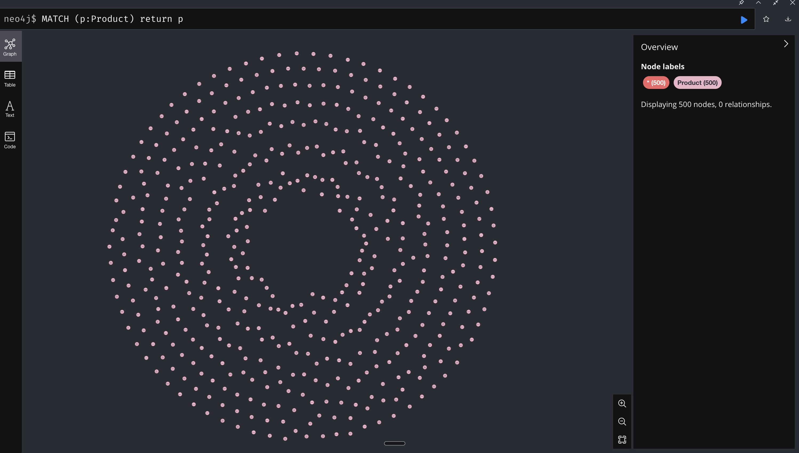
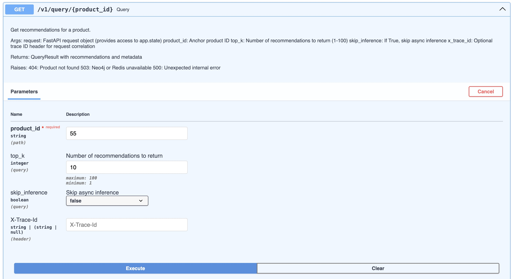
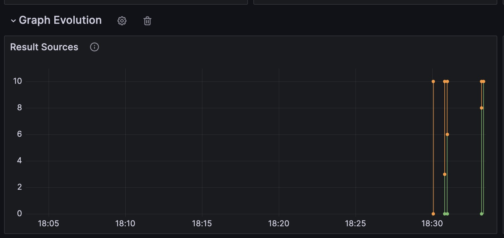
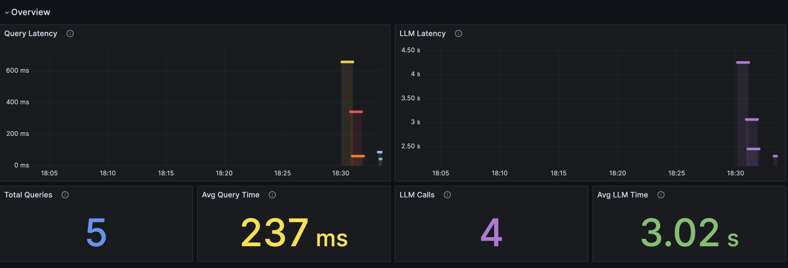
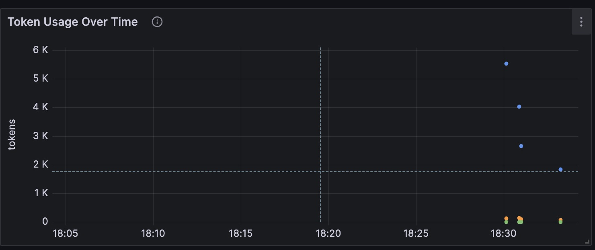

<div align="center">


</div>

<br />

Adjacent is an open-source experimentation framework for building cold-start recommendation systems without behavioral data. It transforms a raw product catalog into a semantic, graph-based recommendation engine using embeddings, LLM inference, and a lazily constructed knowledge graph.

---

## Demo Video

**[▶ Watch the full demo on Loom](https://www.loom.com/share/018c20b00b84470da28c89616f870a76)**

In this demo, you'll see:

- Live recommendation queries via the API
- How repeated queries trigger lazy graph construction
- The resulting structure in Neo4j as edges accumulate
- How latency and inference behavior change over time in Grafana

The demo is intentionally light on implementation details and focuses on illustrating the system's behavior and dynamics. Setup and architecture are covered elsewhere in the documentation.

---

## Quick Start

Get Adjacent running in 5 minutes:

### Prerequisites

- [Docker](https://docs.docker.com/get-docker/) (with Docker Compose)
- [uv](https://docs.astral.sh/uv/) - Fast Python package manager
- Python 3.11+
- OpenAI API key (for LLM inference)

### Installation

```bash
# Clone the repository
git clone <repo-url>
cd adjacent

# Run setup script (installs dependencies, creates .env)
./scripts/setup.sh

# Add your OpenAI API key to .env
echo "OPENAI_API_KEY=sk-your-key-here" >> .env

# Start everything
make dev
```

That's it! The system will:
1. Start infrastructure (Neo4j, Redis, Grafana, Loki)
2. Ingest demo e-commerce data
3. Embed products using HuggingFace
4. Start API server and worker

### Access Points

- **API Documentation:** [http://localhost:8000/docs](http://localhost:8000/docs)
- **Grafana Dashboard:** [http://localhost:3000](http://localhost:3000) (admin/admin)
- **Neo4j Browser:** [http://localhost:7475](http://localhost:7475) (neo4j/adjacent123)

### Quick Commands

```bash
make dev           # Start everything
make dev-logs      # View logs
make dev-status    # Check service health
make dev-down      # Stop all services
make dev-clean     # Clean everything (removes volumes)
```

### First Query

```bash
# Check system status
curl http://localhost:8000/v1/system/status | jq

# Get recommendations for a product
curl http://localhost:8000/v1/query/<product_id>?top_k=10 | jq
```

### Development Workflow

The `make dev` command runs everything in Docker with hot reload enabled. Changes to Python files in `src/` are automatically picked up.

**For advanced development** (native Python with separate terminals):

```bash
# Terminal 1: Start infrastructure
make reset-full

# Terminal 2: Start API
make api-start

# Terminal 3: Start worker
make worker
```

This gives you more control and better debugging visibility, but requires managing multiple processes.

**Testing different embedding providers:**

```bash
# Use HuggingFace (default, runs locally)
make embed

# Use OpenAI embeddings (requires OPENAI_API_KEY in .env)
make embed-openai
```

---

## Why Adjacent Exists

Most recommendation systems assume you already have:

- User clicks
- Purchases
- Sessions
- Co-occurrence logs

But many catalogs start with none of that.

Adjacent explores a different question:

> Can we build useful recommendation structure starting only from a catalog and make it cheaper, faster, and more reliable as the system is used?

### The Core Idea

Instead of committing to heavy offline pipelines or permanent LLM inference, Adjacent is designed to transition from vector-heavy to graph-native recommendations.

- **Embeddings** provide the initial signal
- **LLMs** infer relationships asynchronously, only where needed
- A **knowledge graph** is built lazily, anchored to real queries

**LLM inference is not part of the serving path.** It is used only to construct and reinforce structure.

Once a product's local graph becomes sufficiently dense, queries for that product rely purely on graph-based retrieval. Meaning, no LLM inference, lower latency, and lower cost.

**As the graph matures:**
- LLM calls drop
- Latency improves
- Cost amortizes naturally

What begins as a cold-start solution gradually becomes a reusable semantic asset: one that supports recommendations first, then broader reasoning and analysis as the graph matures.

### Design Rationale

Adjacent is designed around the hypothesis that:
1. Graph queries become faster and cheaper than repeated embedding+LLM inference
2. Real query demand naturally builds useful structure
3. Edge reuse across products amortizes inference cost

Initial testing on product catalogs confirms these patterns, but large-scale validation remains open research.

---

## See It In Action

Once the system is running (`make dev`), here's how to explore Adjacent's behavior:

### 1. View Your Product Nodes in Neo4j

Open the Neo4j Browser at [http://localhost:7475](http://localhost:7475) and run:

```cypher
MATCH (p:Product) RETURN p
```

You'll see your product catalog as disconnected nodes - no relationships yet.



### 2. Query the API

Open the FastAPI docs at [http://localhost:8000/docs](http://localhost:8000/docs). Navigate to the `/v1/query/{product_id}` endpoint:

1. Pick a product ID from your catalog
2. Set `top_k` (e.g., 10 recommendations)
3. Click **Execute**



The API returns recommendations immediately using embeddings. Meanwhile, a background worker runs LLM inference to discover and materialize edges.

### 3. Watch the Graph Evolve

Go back to Neo4j and rerun the same Cypher query. After a few API calls, you'll see edges forming between products:


Zoom in to inspect the relationship types and structure:


Each edge represents an LLM-inferred relationship (`SIMILAR_TO`, `COMPLEMENTS`, etc.) that will be reinforced as more queries pass through.

### 4. Monitor System Behavior in Grafana

Open Grafana at [http://localhost:3000](http://localhost:3000) (admin/admin) to observe how the system evolves:

**Graph Evolution** - Watch retrieval transition from vector-to-graph based:



**Query & LLM Latency** - See how latency decreases over time as the graph matures and fewer LLM calls are needed:



**Token Economics** - Track LLM token usage and observe how it amortizes as the graph becomes self-sufficient:



---

## Key Design Principles

### 1. Lazy, Not Exhaustive

- No full pairwise graph construction
- No offline O(N²) jobs
- Edges are inferred only when a product is queried

This keeps the system:
- Cheap to start
- Fast to prototype
- Aligned with real usage

### 2. Anchors Drive Truth

- Every graph inference is tied to a **query anchor**
- An anchor is the product that triggered inference
- Edges are reinforced only when they appear under **distinct anchors**

This reduces reliance on single-shot LLM inference

### 3. Deterministic Where Possible, LLM Only Where Necessary

| Component | Approach |
|-----------|----------|
| Product normalization | Deterministic |
| Canonical edge IDs | Deterministic |
| Confidence scoring | Deterministic |
| Relationship inference | LLM |

LLMs are used only to infer relationships that cannot be derived mechanically.

### 4. Schema-First, Flat, Auditable

- Products, edges, and patches are all validated against JSON Schemas
- Edge schemas are flat by design (no nested objects)
- Everything written to Neo4j can be logged as JSONL for traceability

---

## What Adjacent Is (and Isn't)

| It is | It is not |
|-------|-----------|
| A cold-start recommendation engine | A production-ready recommender |
| A graph-first design exploration | A replacement for collaborative filtering |
| A framework for experimenting with LLM-assisted structure discovery | A UI product |

---

## System Architecture

### 1. Product Ingest & Normalization

- **Input:** user-provided JSON catalog
- **Enforced schema:** [`schemas/product.json`](schemas/product.json)
- **Normalized fields:** title, description, category, tags, etc.
- **Storage:** `(:Product)` nodes in Neo4j

### 2. Embedding Layer

Pluggable embedding providers:
- OpenAI
- HuggingFace (local)
- *(extensible to others)*

Products are embedded in batches. Vectors are stored directly on Product nodes, and a Neo4j vector index is used for similarity search.

### 3. Query Flow (Core Loop)

When a product `X` is queried:

```
1. Fetch existing graph neighbors of X (Neo4j edges)
2. If needed, retrieve vector-similar candidates to fill the response to top-K
3. Decide which *vector* candidates should be sent for async inference (endpoint reinforcement gating):
   - Not connected → Include
   - Connected but still “early” → Include (endpoint reinforcement)
   - Connected and “mature” → Filter out
4. Enqueue an async inference job: infer_edges(anchor=X, candidate_ids=[...])
5. Return recommendations immediately (graph + vector mix)
6. Worker runs later:
   - Calls LLM with (anchor=X, candidates=[...]) and receives edge patches for:
     - Anchor↔candidate edges (X↔B, X↔C, etc.)
     - Candidate↔candidate edges (B↔C, B↔D, etc.) among the provided candidates
   - Materializes + upserts edges into Neo4j (reinforcement via anchors_seen)
```

This loop repeats, gradually enriching the graph with both direct and transitive relationships.

**Key Decision Point (Step 3):**
- With endpoint reinforcement enabled: already-connected *vector* candidates can be re-sent for inference, but only up to a threshold (default: 3 anchors, confidence < 0.70)
- After threshold: Only third-party anchors can reinforce the edge
- This balances fast reinforcement for popular products with efficiency
- The threshold is configurable via `AsyncConfig.endpoint_reinforcement_threshold` - higher values allow more reinforcement attempts (larger batches, faster convergence) while lower values prioritize efficiency

---

## Edge Model

All recommendation edges are:

- **Symmetric**
- **Canonicalized** (`from_id <= to_id`)
- **Typed**
- **Confidence-scored**
- **Anchor-reinforced**

### Edge Types (v1)

| Type | Description |
|------|-------------|
| `SIMILAR_TO` | Products with similar attributes/purpose |
| `COMPLEMENTS` | Products that work well together |
| `SUBSTITUTE_FOR` | Products that can replace each other |
| `OFTEN_USED_WITH` | Products commonly used in conjunction |

> **Note:** No behavioral semantics are assumed. These are world-knowledge relationships, not user-interaction claims.

### Edge Type Uniqueness

**Important design decision:** Multiple edge types can exist between the same product pair.

The `edge_id` is computed as `hash(edge_type + from_id + to_id)`, meaning:
- `B↔C (COMPLEMENTS)` and `B↔C (SUBSTITUTE_FOR)` are **separate edges**
- Each has its own `anchors_seen` and confidence score
- Both can coexist in the graph

**Why allow this?**
- A product pair may genuinely have multiple relationship types
- Example: A keyboard COMPLEMENTS a mouse AND is OFTEN_USED_WITH a mouse
- The LLM prompt instructs "choose the single best edge_type" per call, but different anchor contexts may yield different judgments

**Implication:** When querying recommendations, you may see the same product pair with different edge types. The one with higher confidence (more anchors) is typically more reliable.

---

## Anchors & Confidence

An edge becomes trustworthy not because the LLM said so once, but because **it keeps reappearing under different anchors**.

### How Reinforcement Works

When the LLM infers an edge, the system checks if that edge already exists:

| Scenario | Action |
|----------|--------|
| Edge is new | Create with `anchors_seen=[current_anchor]`, confidence=0.55 |
| Edge exists, anchor is new | Append anchor to `anchors_seen`, recalculate confidence |
| Edge exists, anchor already seen | No change (same anchor can't reinforce twice) |

**Example: Candidate↔Candidate Reinforcement**

```
Query anchor A → candidates [B, C, D]
  └── LLM infers B↔C (COMPLEMENTS)
  └── Edge created: B↔C, anchors_seen=[A], confidence=0.55, status=PROPOSED

Query anchor E → candidates [B, C, F]
  └── LLM re-infers B↔C (COMPLEMENTS)
  └── Edge exists! anchors_seen=[A, E], confidence=0.63, status=PROPOSED

Query anchor G → candidates [B, C, X]
  └── LLM re-infers B↔C (COMPLEMENTS)
  └── Edge exists! anchors_seen=[A, E, G], confidence=0.70, status=ACTIVE
```

**Key insight:** The edge B↔C was discovered from three different anchor contexts. With endpoint reinforcement enabled, B or C themselves can also serve as anchors (up to the threshold), but after the threshold, only third-party anchors (A, E, G, etc.) can reinforce the edge.

**Confidence grows via a capped exponential heuristic:**
- Base confidence: 0.55 (single anchor)
- Growth rate: 0.15 per additional anchor
- Hard cap: 0.95 (no false certainty)
- ACTIVE threshold: 0.70 (typically ~3 distinct anchors)

### Confidence as a Ranking Signal

The confidence score serves a dual purpose: it gates edge status (PROPOSED vs ACTIVE) and provides a natural ranking mechanism during retrieval.

When returning recommendations, products connected via high-confidence edges can be ranked above those with newer, less-validated relationships. This means the system returns not only semantically relevant products but also prioritizes relationships that have been independently validated across multiple anchor contexts.

This ranking signal emerges organically from the reinforcement process. No separate scoring model is required. Edges that survive repeated inference from diverse anchors carry an implicit quality prior, reducing the influence of single-shot LLM errors or context-specific artifacts.

In practice, this enables a two-dimensional ranking strategy:

1. **Relevance**: Which products are related (via edge type and graph structure)
2. **Reliability**: How well-established is that relationship (via confidence score)

Both dimensions are available at query time without additional computation.

---

## Filtering & Reinforcement Logic

### Reinforcement Flow

The system uses a **two-phase reinforcement strategy**:

1. **Endpoint Reinforcement** (when enabled): Edges can be reinforced by querying their endpoints (B or C for edge B-C), but only up to a threshold
2. **Third-Party Anchor Reinforcement**: After the threshold, edges can only be reinforced via third-party anchors (A, E, G, etc.)

This balances fast reinforcement for popular products with efficiency (avoiding redundant LLM calls).

### Anchor↔Candidate Edges

**Default Behavior (Endpoint Reinforcement Enabled):**

Before asking the LLM, we check if candidates are already connected to the anchor:
- **Not connected**: Include candidate → LLM will create new edge
- **Connected with low anchors (< threshold)**: Include candidate → LLM will reinforce edge
- **Connected with high anchors (≥ threshold)**: Filter out → Avoid redundant inference

**Configuration:**
- `allow_endpoint_reinforcement: bool = True` - Enable/disable endpoint reinforcement
- `endpoint_reinforcement_threshold: int = 3` - Max anchors_seen count for endpoint reinforcement (configurable to tune batch sizes and convergence behavior)
- `endpoint_reinforcement_max_confidence: float = 0.70` - Max confidence for endpoint reinforcement

**Note on multiple edge types:** If multiple semantic edge types exist between the same pair (e.g., `A↔C (COMPLEMENTS)` and `A↔C (SUBSTITUTE_FOR)`), endpoint reinforcement gating uses the **maximum** anchors_seen count and **maximum** confidence across those types. This keeps filtering stable and prevents repeatedly re-inferencing a pair once *any* relationship type is already “mature”.

**Flow Diagram:**

```
Query B → C appears as vector candidate
  ↓
Check: Does B-C exist?
  ├─ No → Include C → LLM(B, [C, ...]) → Create B-C
  └─ Yes → Check metadata:
      ├─ anchors_seen < threshold AND confidence < 0.70?
      │   └─ Yes → Include C → LLM(B, [C, ...]) → Reinforce B-C
      └─ No → Filter C → No LLM call for B-C
```

**Example with Endpoint Reinforcement (threshold=3):**

```
Initial: B-C exists, anchors_seen=[A], confidence=0.55

Query B → C appears as candidate
  └── Check: B-C has 1 anchor (< threshold of 3)
  └── Include C → LLM(B, [C, D, E])
  └── LLM re-infers B-C → anchors_seen=[A, B], confidence=0.63

Query B again → C appears as candidate
  └── Check: B-C has 2 anchors (< threshold of 3)
  └── Include C → LLM(B, [C, D, E, F])
  └── LLM re-infers B-C → anchors_seen=[A, B, B], but B already seen → no change

Query B third time → C appears as candidate
  └── Check: B-C still has 2 distinct anchors (< threshold of 3)
  └── Include C → Eventually third-party anchor will reinforce

Query G → candidates [B, C]
  └── LLM(G, [B, C]) → LLM infers B-C
  └── anchors_seen=[A, B, G], confidence=0.70 → ACTIVE (threshold reached)
```

**Why This Design?**
- **Early edges** (few anchors) benefit from endpoint reinforcement → faster confidence growth
- **Mature edges** (many anchors) rely on third-party anchors → avoids redundant calls
- **Popular products** queried frequently can still reinforce their edges (up to threshold)
- **Efficiency**: Prevents infinite reinforcement loops from repeated endpoint queries

**Legacy Behavior (Endpoint Reinforcement Disabled):**

If `allow_endpoint_reinforcement=False`, all connected candidates are filtered out:
- Reinforcement only happens via **reciprocal discovery** (query B, find A as candidate)
- More conservative, but edges may take longer to reach ACTIVE status

### Candidate↔Candidate Edges

We **do NOT filter** candidate↔candidate edges before the LLM call.

**Why no filtering?**
- Candidate↔candidate edges are discovered indirectly (via anchor queries)
- Re-inference from different anchors IS the reinforcement mechanism
- The current anchor is recorded in `anchors_seen` regardless

**Example:**
```
Query A → candidates [B, C] → LLM infers B↔C → created (anchors_seen=[A])
Query E → candidates [B, C] → LLM re-infers B↔C → reinforced (anchors_seen=[A, E])
```

The edge B↔C is strengthened because two independent anchor queries both led to its discovery.

---

## Storage Strategy

**Neo4j** is the primary store:
- Products
- Recommendation edges
- Vector index

**Optional JSONL logs** for:
- Edge patches
- Materialized edges
- Debugging and replay

> No separate vector DB is required.

---

## Assumptions

Adjacent explicitly assumes:

1. You have **no behavioral data**
2. Product descriptions are **semantically meaningful**
3. LLMs can infer reasonable **world-knowledge relationships**
4. Global graph coherence is less important than **local correctness**
5. Reinforcement over time matters more than **single-shot accuracy**

---

## Known Limitations & Future Considerations

The following are acknowledged limitations in v1, documented here to inform future iteration:

### 1. LLM Usage Is Front-Loaded

LLM inference in Adjacent is naturally amortized. As graph neighborhoods mature, vector candidates are filtered and inference is skipped. Early runs may incur higher LLM usage, but mature regions rely primarily on graph traversal.

Future work may explore explicit saturation thresholds, caching, or batch inference.

### 2. No Edge Decay or Dispute Mechanism

The graph is monotonic in v1. Edges are never removed or demoted. This is an intentional simplification prioritizing auditability and clarity.

Future iterations may introduce decay, review, or type migration mechanisms.

### 3. Single Embedding Field

Currently `embed_text` is derived only from description.

**For richer retrieval:**
- Concatenate title + category + tags into `embed_text`
- The `EmbeddingConfig` is designed for this  -  extend `FIELDS` tuple and bump `VERSION`

### 4. Local Correctness Over Global Optimality

Adjacent favors local correctness around active anchors rather than enforcing global graph coherence. This tradeoff simplifies reasoning but may allow early inaccuracies to persist.

### 5. No Formal Evaluation Framework

Adjacent does not include a built-in evaluation framework for validating inferred edges against ground truth.

Edges are inferred by an LLM using world knowledge and reinforced over time via distinct anchor contexts. While this reinforcement mechanism reduces the impact of single-shot errors, it does not guarantee correctness. Incorrect or weakly grounded edges may persist, particularly in early stages or in low-diversity query regimes.

This reflects a broader challenge in cold-start recommendation: when no behavioral data exists, there is no obvious objective signal to evaluate against.

**That said, Adjacent is designed to be inspectable and auditable by construction:**

- Edge provenance is tracked
- Confidence grows only via anchor diversity
- Early edges are capped and require repeated reinforcement

**Future directions may include:**

- Meta-evaluation agents that review edges for consistency or plausibility
- Human-in-the-loop review workflows
- Dataset-specific validation heuristics

Adjacent prioritizes useful structure over perfect certainty, under the assumption that a weak but improving semantic graph is often more valuable than no structure at all.

---

## Extensions and Research Directions

Adjacent is minimal in v1. However, the architecture enables several natural extensions beyond cold-start recommendation.

### 1. Multimodal Catalog Understanding

While v1 uses text-only embeddings, the same pipeline can support multimodal representations: image embeddings from product photos, text-image fusion, or video and audio for media catalogs. These embeddings can seed vector retrieval, inform LLM inference, and propagate into the graph structure. This allows Adjacent to operate on catalogs where semantics are visual or multimodal by nature, such as fashion, furniture, or art.

### 2. Graph as a Queryable Medium

The constructed graph is not just a recommendation artifact; it is a structured semantic medium. With an MCP-style interface (Model Context Protocol for LLM tool use), an agent could query the graph directly, reason over neighborhoods and edge types. In this framing, Adjacent becomes a semantic memory layer rather than just a recommender backend.

### 3. Knowledge Graph Construction for Representation Learning

As the graph grows, it encodes higher-order structure that can be reused. Node embeddings learned from the graph (via Node2Vec, GNNs, or similar methods) and edge-type-aware representations can enrich product embeddings with relational context. These representations could support clustering, classification, downstream ML tasks, or bootstrapping supervised models once labels appear. In this sense, Adjacent can act as a pre-training signal generator for later ML pipelines.

---

## Roadmap

The following features and improvements are planned for future versions:

- [x] **Grafana Visualizations** - Add more dashboards and panels in Grafana using the metrics provided (query latency, inference counts, graph vs vector mix, etc.)
- [x] **MCP Integration** - Implement Model Context Protocol server to enable LLM agents to query and reason over the knowledge graph directly
- [ ] **Custom Edge Construction Service** - Deploy a GPU-based LLM inference service using open-source Llama models (e.g., 3B parameter) on AWS to enable custom edge construction as an alternative to OpenAI, reducing cost and enabling self-hosted inference
- [ ] **GNN-Based Knowledge Graph Analysis** - Investigate the use of constructed knowledge graphs in downstream tasks, including graph neural networks and other techniques for information distillation, representation enrichment, and catalog-level learning
- [ ] **Evaluation Framework** - Build a validation system for assessing edge quality, including meta-evaluation agents and dataset-specific validation heuristics
- [ ] **Rate Limiting & Authentication** - Add production-grade API hardening with rate limiting, authentication, and request throttling
- [ ] **Negative Edge Tracking** - Track candidate pairs that the LLM consistently doesn't connect, preventing redundant inference retries (see [docs/graph_convergence.md](docs/graph_convergence.md))

Contributions are welcome. See issues for active discussions.

---

## License

Adjacent is released under the [MIT License](LICENSE).

Copyright (c) 2026 Adjacent Contributors

Permission is hereby granted, free of charge, to any person obtaining a copy of this software and associated documentation files (the "Software"), to deal in the Software without restriction, including without limitation the rights to use, copy, modify, merge, publish, distribute, sublicense, and/or sell copies of the Software, and to permit persons to whom the Software is furnished to do so, subject to the following conditions:

The above copyright notice and this permission notice shall be included in all copies or substantial portions of the Software.

THE SOFTWARE IS PROVIDED "AS IS", WITHOUT WARRANTY OF ANY KIND, EXPRESS OR IMPLIED, INCLUDING BUT NOT LIMITED TO THE WARRANTIES OF MERCHANTABILITY, FITNESS FOR A PARTICULAR PURPOSE AND NONINFRINGEMENT. IN NO EVENT SHALL THE AUTHORS OR COPYRIGHT HOLDERS BE LIABLE FOR ANY CLAIM, DAMAGES OR OTHER LIABILITY, WHETHER IN AN ACTION OF CONTRACT, TORT OR OTHERWISE, ARISING FROM, OUT OF OR IN CONNECTION WITH THE SOFTWARE OR THE USE OR OTHER DEALINGS IN THE SOFTWARE.
